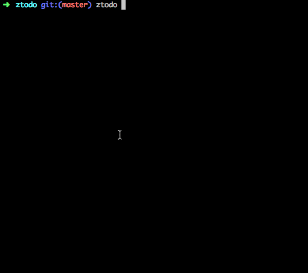

# ztodo 

A simple command-line todo list written in Go.

## Version

0.4.6

## Installation:

+ Install Go:
  
  http://golang.org/doc/install.html

+ Install ztodo:
  
  $ go get github.com/jack-zh/ztodo

## Usage:

    ztodo list|ls [verbose]    -- Show all tasks
    ztodo list|ls N [verbose]  -- Show task N
    ztodo rm|remove N          -- Remove task N
    ztodo done N               -- Done task N
    ztodo undo N               -- Undo task N
    ztodo doing N              -- Doing task N
    ztodo clean                -- Rm done task
    ztodo clear                -- Rm all task
    ztodo add ...              -- Add task to list

## Next version 0.5:

+ Base server
+ Base client pull push

## License:

 MIT
